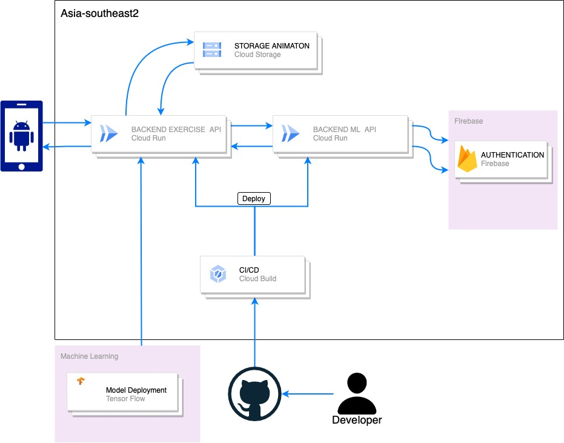

# GymGuide-Cloud Computing

 This repository contains a collection of resources used during the capstone project for Bangkit Cloud Computing. This project focuses on creating an API using express.js which will be used by the mobile development team. 

## Architecture

 The architecture in cloud computing begins with developers working on their projects and uploading them to the GitHub repository. Subsequently, on the Google Cloud Platform, the Cloud Build service is utilized to clone and execute the Dockerfile. Once the build process is complete, the application is deployed using Cloud Run and becomes ready for use. 

  

## Requirements

To run the project, the following dependencies are required:

- Node.js
- Express.js

## Contributing

 Contributions to this project are welcome. If you have any ideas, suggestions, or improvements, please submit a pull request. Make sure to follow the existing coding style and guidelines. 

## License

This project is licensed under the [MIT License](https://opensource.org/licenses/MIT). Feel free to use, modify, and distribute the code as per the license terms.

## Contact

For any inquiries or feedback, please contact the project team.
