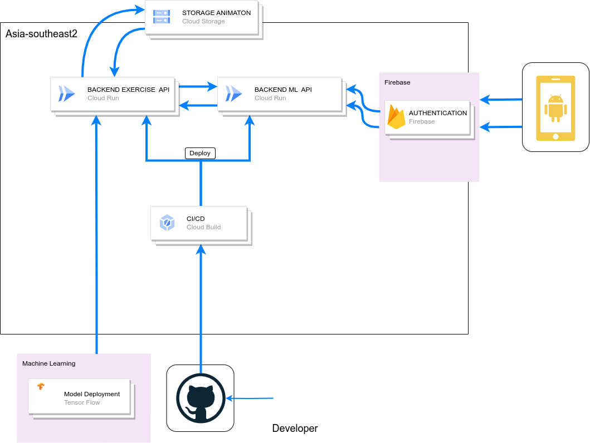

# GymGuide-Cloud Computing

<p align="justify"> This repository contains a collection of resources used during the capstone project for Bangkit Cloud Computing. This project focuses on creating an API using express.js which will be used by the mobile development team. </p>

## Architecture

<p align="justify"> The architecture in cloud computing begins with developers working on their projects and uploading them to the GitHub repository. Subsequently, on the Google Cloud Platform, the Cloud Build service is utilized to clone and execute the Dockerfile. Once the build process is complete, the application is deployed using Cloud Run and becomes ready for use. </p>

<p align="center">
  
</p>

### Requirements For Exercises API
To run the project, the following dependencies are required:

- Node.js
- Express.js

### Requirements For Macnine learning API
To run the project, the following dependencies are required:

- Python
- Flask

## List API

### Predict API
This API is used to obtain prediction results from the model.
```
URL: BASE URL/prediction
Method: POST
Request Body :
{
    image: image.jpg
}
Success Response :
{
    "data": {
        "confidence": 0.9999566078186035,
        "soil_types_prediction": "bench-press"
    },
    "status": {
        "code": 200,
        "message": "Success predicting"
    }
}
```
### Exercises API
This API is used to retrieve exercises based on equipment and muscle.
```
URL: BASE URL/exercises/?equipment=abdominal-machine
Query Params : equipment -> opsional
Query Params : muscle -> opsional
Method: GET
Success Response :
{
    "data": [
        {
            "id": 1,
            "name": "Abdominal Machine Crunch",
            "type": "strength",
            "muscle": "abdominals",
            "equipment": "abdominal-machine",
            "difficulty": "beginner",
            "instructions": "Adjust the abdominal machine to your height and sit on the seat facing the pads. Grasp the handles or place your hands on the designated grips. Keep your back pressed against the pad and initiate the movement by contracting your abdominal muscles. Bring your chest towards your knees, exhaling as you crunch. Hold the contraction briefly, then inhale as you return to the starting position.",
            "link": "https://www.youtube.com/embed/_O1xunCfYEM?si=KMYaVhP_Tw_i6Qmi",
            "picture": "https://envato-shoebox-0.imgix.net/ded9/7d05-46c4-480e-ae15-d512df443d94/ALEX4218.jpg?auto=compress%2Cformat&mark=https%3A%2F%2Felements-assets.envato.com%2Fstatic%2Fwatermark2.png&w=1000&fit=max&markalign=center%2Cmiddle&markalpha=18&s=34f00f4f4095ed743fa17e3db6aea32b",
            "animation": "https://storage.googleapis.com"
        },
        {
            "id": 2,
            "name": "Seated Leg Raise on Abdominal Machine",
            "type": "strength",
            "muscle": "abdominals",
            "equipment": "abdominal-machine",
            "difficulty": "beginner",
            "instructions": "Adjust the abdominal machine to your height and sit on the seat with your back against the pad. Place your arms on the designated supports and grip the handles. Lift your legs by flexing your hips, bringing your knees toward your chest. Pause at the top, then lower your legs back down with control to the starting position.",
            "link": "https://www.youtube.com/embed/ghwdoXHeiIk?si=N4wDsYkTXToYJw7R",
            "picture": "https://img.freepik.com/free-photo/handsome-black-man-is-engaged-gym_1157-29621.jpg",
            "animation": "https://storage.googleapis.com"
        },
    ]
 }
```

## Contributing

<p align="justify"> Contributions to this project are welcome. If you have any ideas, suggestions, or improvements, please submit a pull request. Make sure to follow the existing coding style and guidelines. </p>

## License

This project is licensed under the [MIT License](https://opensource.org/licenses/MIT). Feel free to use, modify, and distribute the code as per the license terms.

## Contact

For any inquiries or feedback, please contact the project team.
